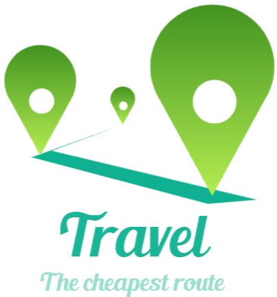

<h1 align="center">
  
</h1>

The project facilitates tourists who wish to travel the world by paying the lowest possible price regardless of the number of connections.

## 💻 Technologies used
- NodeJs in API (https://nodejs.org/en/).

## ✋🏻 Prerequisite
To execute this project you will need to have the following components in your environment.
### Package Manager
It'll be responsible for the commands to start the application. You can choose your preference:
- NPM (https://www.npmjs.com/get-npm)
- Yarn (https://classic.yarnpkg.com/en/docs/install)

## 👨‍💻 Running
### **ClI engine**
TBD

### **API engine**
TBD

## 📝 Tests
